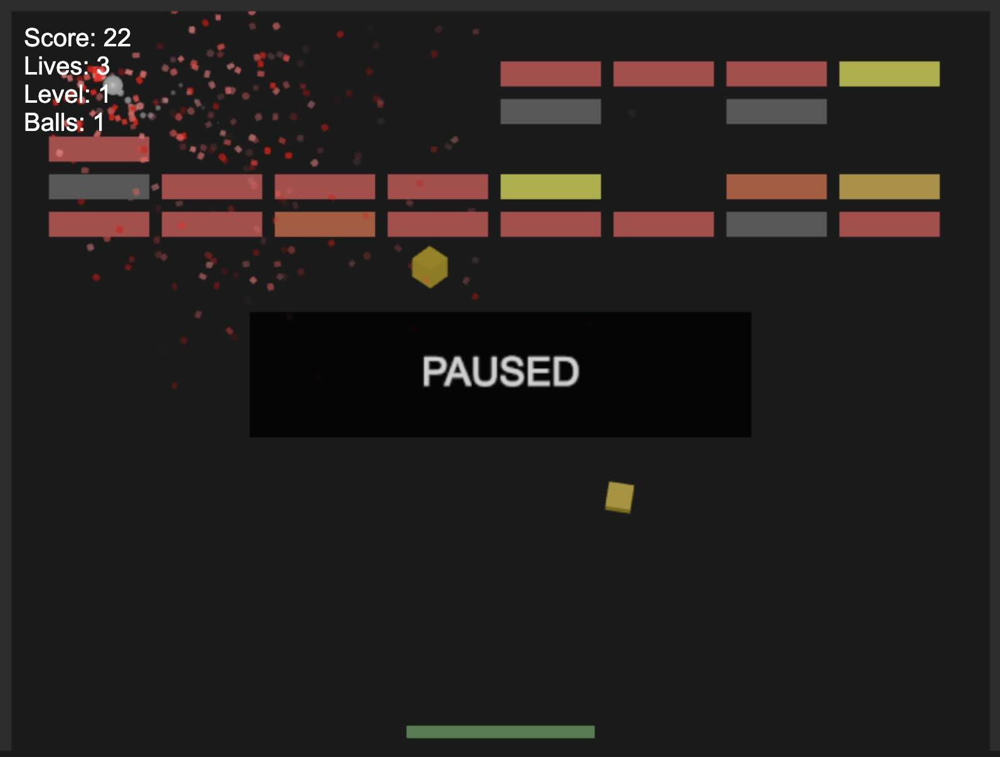

# Claude Breakout
A Breakout game, using JS+Canvase+Three.js, generated by Claude AI.

Try it here: https://tmikov.github.io/claude-breakout/.

I spent a few hours playing with Claude to generate this. There were a few minor
bugs that I had to fix, but other than that this is all generated code.

The game is not particularly impressive, but it is playable and has the following features:

- Scoring.
- Lives.
- Levels.
- Pausing.
- Different bricks (unbreakable, etc)
- Different kinds of gifts: points, lives, floor, split balls, lasers.

Collision detection and resolution isn't always great. Sometimes the ball gets inside bricks.

## ChatGPT 4o Version

I also spent some time creating a version with ChatGPT 4o. You can see it [here](./chatgpt-4o/).

It is more primitive since I ran into length limitations and ChatGPT was unable to successfully split it into multiple files.
